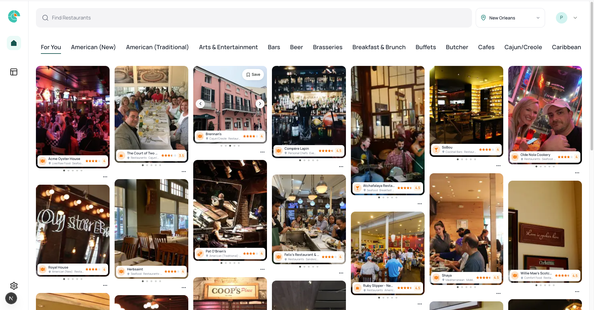
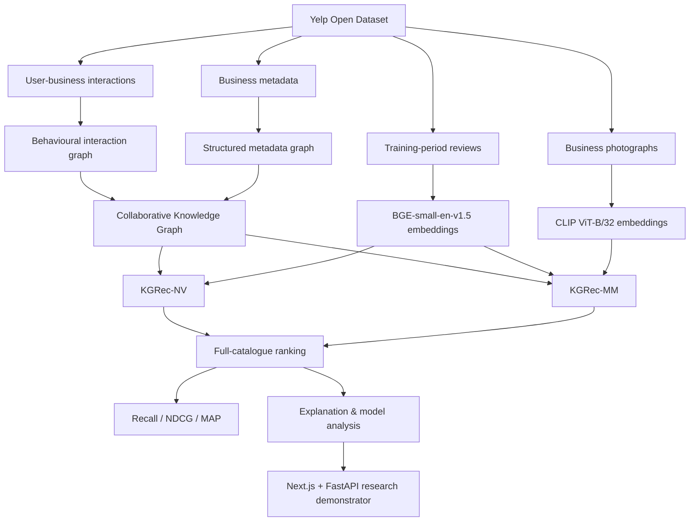
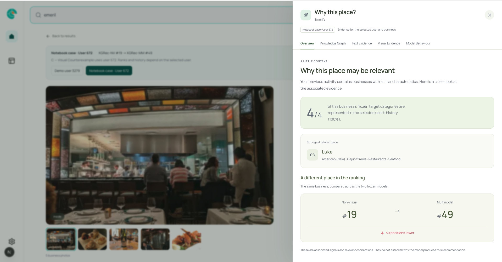
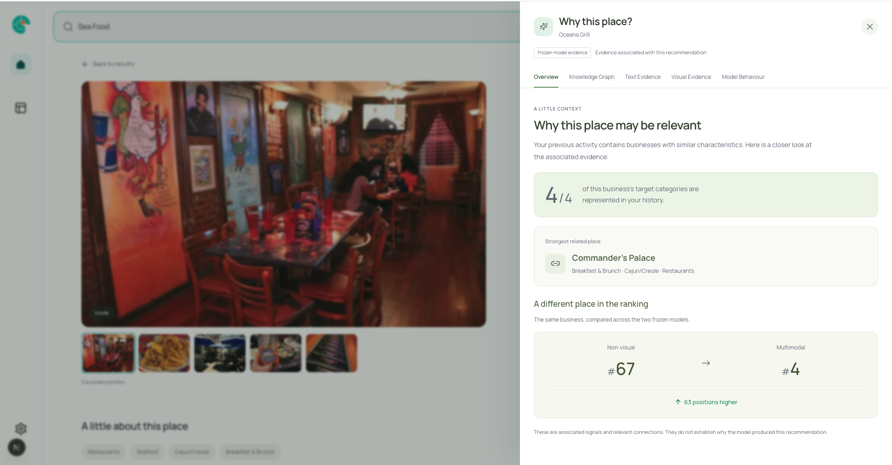
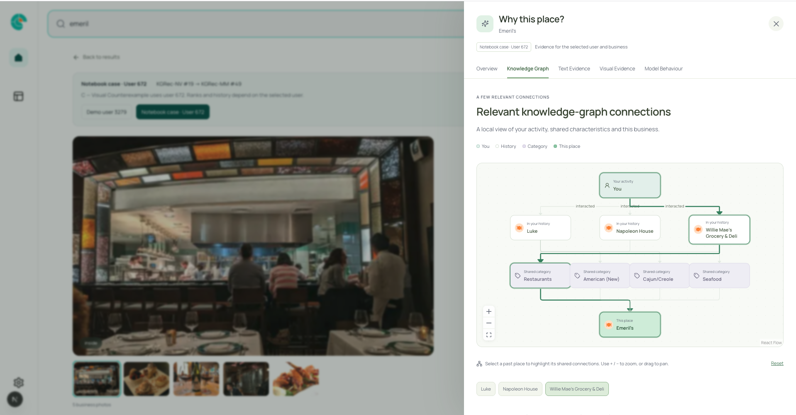
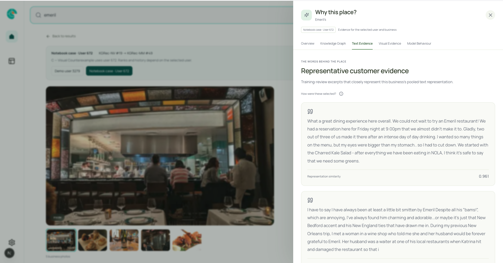
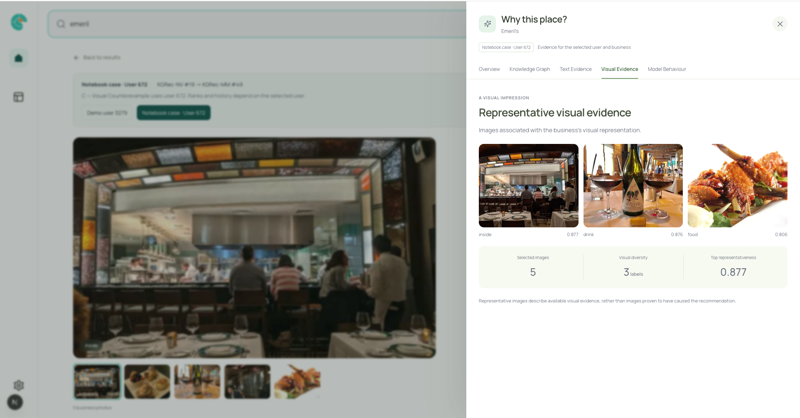
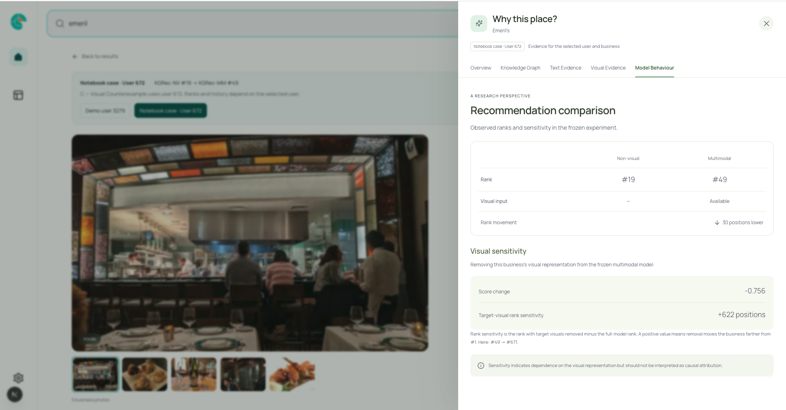
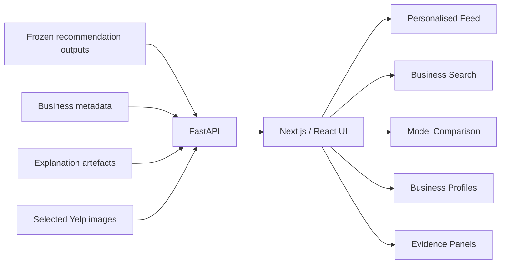

# Explainable Multimodal Knowledge-Aware Recommender System

> **A KGRec-inspired personalised recommender for local-business discovery that combines behavioural interactions, structured knowledge-graph information, review-text embeddings and visual embeddings, with evidence-grounded explanations and model analysis.**

This research project investigates a practical question:

> **Does visual information improve personalised recommendation when it is added to an otherwise equivalent knowledge-aware text-and-graph recommender?**

Using the Yelp Open Dataset, the system was evaluated on **14,991 users** and **2,516 businesses** in New Orleans. Two controlled configurations were compared:

- **KGRec-NV** — behavioural + structured knowledge graph + text
- **KGRec-MM** — behavioural + structured knowledge graph + text + visual information

The multimodal system improved **8 of 9 reported top-K metrics**, with the clearest gains appearing at **K = 20**.

---

## Key Results

| Metric | KGRec-NV | KGRec-MM | Relative change |
|---|---:|---:|---:|
| Recall@5 | 0.0404 | 0.0417 | +3.14% |
| NDCG@5 | 0.0264 | 0.0267 | +0.99% |
| MAP@5 | 0.0218 | 0.0218 | -0.21% |
| Recall@10 | 0.0643 | 0.0676 | +5.08% |
| NDCG@10 | 0.0341 | 0.0350 | +2.52% |
| MAP@10 | 0.0250 | 0.0251 | +0.68% |
| **Recall@20** | **0.1009** | **0.1110** | **+10.05%** |
| **NDCG@20** | **0.0432** | **0.0459** | **+6.12%** |
| MAP@20 | 0.0274 | 0.0281 | +2.50% |

At **K = 20**, the paired bootstrap confidence intervals for the Recall and NDCG improvements excluded zero, providing the strongest evidence that visual information improved retrieval and ranking quality at the broader cut-off.

The result is deliberately interpreted with caution: the visual contribution was **conditional rather than universal**. Improvements varied with behavioural support, image availability and visual richness, and there were also counterexamples where strong visual evidence did not improve the final ranking.

---

## Research Demonstrator

The research system is exposed through a visual-first demonstrator designed around frozen model outputs and explanation evidence.



The demonstrator supports:

- personalised recommendation browsing
- business search
- KGRec-NV vs KGRec-MM ranking comparison
- knowledge-graph evidence
- representative text evidence
- representative visual evidence
- model-behaviour and perturbation analysis
- selected notebook/research cases

The static portfolio version is included in `Demo_app`: it bundles the frozen data and selected photos, so browsing and search require no live Python backend or complete local research environment.

**Public demo:** Coming soon

---

## System Architecture



---

## Dataset and Experimental Scale

The study uses a New Orleans subset of the Yelp Open Dataset focused on food, hospitality and related local businesses.

| Component | Scale |
|---|---:|
| Users | 14,991 |
| Businesses | 2,516 |
| Training interactions | 122,233 |
| Knowledge-graph triples | 206,222 |
| Knowledge-graph entities | 17,819 |
| Relation types | 64 |
| Businesses with visual evidence | 1,729 |
| Businesses without visual evidence | 787 |
| Selected photos in the demonstrator pipeline | 6,681 |

### Knowledge graph composition

The frozen collaborative knowledge graph combines:

- **user → interacted_with → business**
- **business → has_category → category**
- scalar business attributes
- flattened nested business attributes

Validation and test interactions are excluded from the training graph to prevent leakage.

---

## Representation Pipeline

### Text representation

Training-period review text is encoded using **BGE-small-en-v1.5** into **384-dimensional business representations**.

Only information available to the model during training is used when reconstructing representative textual evidence.

### Visual representation

Selected Yelp business photographs are encoded using **CLIP ViT-B/32** into **512-dimensional business representations**.

The visual pipeline preserves image availability and label diversity. Businesses without eligible visual evidence remain explicitly image-less rather than receiving fabricated or stock imagery.

### Structured representation

Business categories and parsed attributes are converted into typed knowledge-graph relations.

### Behavioural representation

Positive user-business interactions form the collaborative component of the graph and provide the personalisation signal.

---

## Model Configurations

The research uses two controlled configurations.

### KGRec-NV

**Inputs**

- collaborative knowledge graph
- structured metadata
- behavioural interactions
- review-text representations

This is the non-visual comparison condition.

### KGRec-MM

**Inputs**

- collaborative knowledge graph
- structured metadata
- behavioural interactions
- review-text representations
- visual business representations

The surrounding recommendation architecture is kept equivalent so that the effect of adding visual information can be evaluated directly.

---

## Evaluation Design

The recommendation experiment uses:

- **per-user temporal splitting**
- **full-catalogue ranking**
- exclusion of businesses already observed in the user's training/validation history
- one held-out relevant target per test user

### Metrics

- Recall@5, @10, @20
- NDCG@5, @10, @20
- MAP@5, @10, @20

The multimodal system achieved:

- Recall@20 = **0.1110**
- NDCG@20 = **0.0459**
- MAP@20 = **0.0281**

For context, a random ranking would place the single held-out target within the top 20 for roughly **0.8%** of cases in the unmasked 2,516-business catalogue, while the observed multimodal Recall@20 was **11.10%**.

---

## What Did Visual Information Add?

The controlled KGRec-MM versus KGRec-NV comparison showed that visual information improved most reported top-K metrics, but its effect was not uniform.

The largest relative improvements appeared at K = 20:

- **Recall@20: +10.05%**
- **NDCG@20: +6.12%**
- **MAP@20: +2.50%**

The primary-cut-off NDCG@10 improvement was smaller and its confidence interval included zero, so the project does **not** claim that multimodal information was universally superior.

The analysis instead asks **when** visual information contributes useful signal.

---

## Explainability and Evidence Analysis

The explanation layer was designed to avoid presenting associated evidence as causal proof.

The system separates:

- evidence available to the model
- model sensitivity
- ranking outcome

This distinction is important because a business may have strong structured, textual and visual evidence without that evidence necessarily being the reason it received a particular rank.

### Overview

The overview summarises personalised category overlap, a related historical business and the same business's rank under the non-visual and multimodal models.



The demonstrator can also surface positive multimodal examples where the same business moves substantially higher in the ranking.



### Knowledge-Graph Evidence

Structured evidence connects the selected user, previously interacted-with businesses, shared categories and the recommended business.



This view is intended as **contextual evidence**, not an explicit causal reasoning path.

### Text Evidence

Representative training-period reviews are selected by similarity to the pooled BGE business representation.



The interface exposes the similarity value so the relationship between the displayed evidence and the learned representation remains inspectable.

### Visual Evidence

Representative photographs are selected from the final CLIP image manifest.



The visual panel exposes:

- selected images
- visual labels
- visual diversity
- representation similarity

The images describe the visual evidence available to the model. They are **not** presented as images proven to have caused the recommendation.

### Model Behaviour

The model-behaviour view compares the same business under the non-visual and multimodal configurations and exposes visual sensitivity from frozen-model perturbation.



The Emeril's case shown above is a deliberate counterexample:

- non-visual rank: **#19**
- multimodal rank: **#49**
- change: **30 positions lower**
- removing the target visual representation from the frozen multimodal model causes a large rank shift

This demonstrates why modality sensitivity and ranking benefit should not be treated as the same thing.

---

## Visual Perturbation Analysis

Visual information is masked at inference time under multiple conditions:

- catalogue-wide removal
- target-specific removal
- missing-modality competition

The analysis measures how the **frozen multimodal model** responds when visual information changes.

These experiments are interpreted as **sensitivity evidence**, not causal estimates of visual importance.

Catalogue-wide visual removal reduced all nine reported top-K measures, providing complementary evidence that the multimodal model made meaningful use of the visual channel.

---

## Conditional Analysis

The project investigates whether multimodal benefit changes with:

- user-history density
- target-business interaction support
- image quantity
- visual-label diversity
- metadata richness
- image availability

Adjusted analyses found that **visual-label diversity showed a clearer relationship with multimodal benefit than image quantity alone**.

This suggests that the variety of useful visual information may matter more than simply having more photographs.

---

## Research Demonstrator Architecture

The original research demonstrator uses:

- **Next.js**
- **React**
- **TypeScript**
- **FastAPI**
- **Python**



The backend exposes completed recommendation and explanation artefacts to the interface **without retraining or modifying the evaluated models**.

---

## Demonstrator Features

The application currently supports:

- a visual-first personalised feed
- search across all 2,516 catalogue businesses
- exact frozen KGRec-NV and KGRec-MM ranks
- business profiles
- recommendation evidence
- selected research/notebook cases
- visual availability states
- model-sensitivity diagnostics
- responsive layouts

The local research version uses genuine Yelp metadata and selected Yelp photographs associated with the frozen experimental catalogue.

---

## Repository Structure

The research workflow is organised in pipeline order.

| Notebook | Purpose |
|---|---|
| `00_yelp_dataset_extration.ipynb` | Extract local Yelp data |
| `01_yelp_dataset_exploration.ipynb` | Explore businesses/interactions and prepare the experimental subset |
| `02_yelp_image_embeddings.ipynb` | Select business photos and generate CLIP representations |
| `03_yelp_text_embeddings.ipynb` | Prepare review text and BGE representations |
| `04_yelp_metadata_knowledge_graph.ipynb` | Construct structured metadata and graph relations |
| `05_yelp_kgrec_model.ipynb` | Train and evaluate KGRec-NV and KGRec-MM |
| `06_yelp_visualization.ipynb` | Produce experimental plots and result visualisations |
| `07_yelp_explanation_layer.ipynb` | Analyse frozen model behaviour and explanation cases |

Additional project components:

```text
Knowledge-aware-recommender-system/
├── Dataset_exploration/
│   ├── 00_yelp_dataset_extration.ipynb
│   ├── 01_yelp_dataset_exploration.ipynb
│   ├── 02_yelp_image_embeddings.ipynb
│   ├── 03_yelp_text_embeddings.ipynb
│   ├── 04_yelp_metadata_knowledge_graph.ipynb
│   ├── 05_yelp_kgrec_model.ipynb
│   ├── 06_yelp_visualization.ipynb
│   ├── 07_yelp_explanation_layer.ipynb
│   └── processed_data/
│
├── Demo_app/
│   ├── backend/
│   ├── src/
│   ├── tests/
│   └── README.md
│
├── processed_data/
│
└── README.md
```

---

## Running the Static Demonstrator Locally

The demo serves bundled HTML, JavaScript, JSON and 6,122 selected photos. No Python backend, model weights or processed-data download is needed to build or serve it.

```bash
cd Demo_app
npm ci
npm run build
npm start
```

Open <http://127.0.0.1:3000>. To deploy, publish the contents of `Demo_app/out/` to a static host at the site root. Hosting settings: root directory `Demo_app`, build command `npm run build`, output directory `out`; no backend environment variables are required.

The snapshot supports all 2,516 searchable businesses, presentation user 3279 and five exact notebook cases. Ruby Slipper's notebook case for user 3072 retains ranks **52 → 13**, **60%** category coverage and **+713** target-visual rank sensitivity.

See [the demo README](Demo_app/README.md) for snapshot regeneration and deployment details. Python, processed research artefacts and the original photo library are needed only to regenerate the snapshot. The optional live API and repository-root Docker/Railway configuration are documented in [the live-backend reference](Demo_app/docs/live-backend-reference.md).

### Validation

```bash
npm run lint
npm run typecheck
npm test
npm run build
npm run test:browser
```

Browser checks use installed Google Chrome and a static file server. Research-backend tests remain available separately with the prepared Python environment and source artefacts.

---

## Technology Stack

### Machine Learning

- Python
- PyTorch
- BGE-small-en-v1.5
- CLIP ViT-B/32
- knowledge-aware recommendation
- multimodal representation learning

### Data

- Pandas
- NumPy
- PyArrow
- knowledge graphs
- embedding pipelines

### Application

- FastAPI
- Next.js
- React
- TypeScript

### Evaluation

- Recall@K
- NDCG@K
- MAP@K
- paired bootstrap confidence intervals
- ablation analysis
- perturbation analysis
- conditional regression analysis

---

## Reproducibility

The project uses:

- fixed random seeds
- frozen per-user temporal splits
- deterministic entity indexing
- frozen multimodal representations
- fixed model configurations
- separate preprocessing, graph construction, model training, evaluation and explanation stages
- intermediate validation checks

These choices preserve an auditable path from the authorised source data to the reported results.

---

## Data and Usage Notes

The project uses the **Yelp Open Dataset** for academic research.

Raw Yelp data and the full original image collection are not redistributed through this repository. Reproduction requires independently authorised access to the source dataset.

The public portfolio demonstrator should therefore use only appropriately prepared static/frozen artefacts rather than redistributing the original dataset.

---

## Limitations

This project should not be interpreted as evidence that adding images always improves recommendation.

Important limitations include:

- visual coverage is incomplete across businesses
- visually rich businesses may have stronger representations than businesses with limited photographic evidence
- the study focuses on one geographic/business subset
- evidence panels are not causal explanations
- individual top-K comparisons are related views of the same held-out ranking outcomes
- the original research demonstrator is based on frozen experimental outputs rather than a continuously learning production service

These limitations are part of the research finding rather than something the interface attempts to hide.

---

## Main Takeaway

The study finds that visual information can provide a useful complementary signal for personalised local-business recommendation, but its value depends on the surrounding evidence and recommendation context.

> **More modalities do not automatically produce better recommendations. The useful question is when a modality contributes information that improves the decision.**

---

## Project Status

- [x] Dataset preparation
- [x] Text representation pipeline
- [x] Visual representation pipeline
- [x] Knowledge-graph construction
- [x] Non-visual KGRec configuration
- [x] Multimodal KGRec configuration
- [x] Full-catalogue evaluation
- [x] Visual ablation and perturbation analysis
- [x] Evidence-grounded explanation layer
- [x] Next.js + FastAPI research demonstrator
- [x] Static portfolio demonstrator implementation
- [ ] Public static hosting deployment

---

## Author

**Preye Nabena**

Applied AI & Machine Learning Engineer  
MSc Artificial Intelligence & Machine Learning, University of Portsmouth  
BSc Statistics

- LinkedIn: https://linkedin.com/in/preye-nabena
- Portfolio: https://preye.vercel.app/
- GitHub: https://github.com/Pnabena

---

## Acknowledgement

This project was developed as an MSc Artificial Intelligence & Machine Learning research project at the University of Portsmouth using the Yelp Open Dataset.
